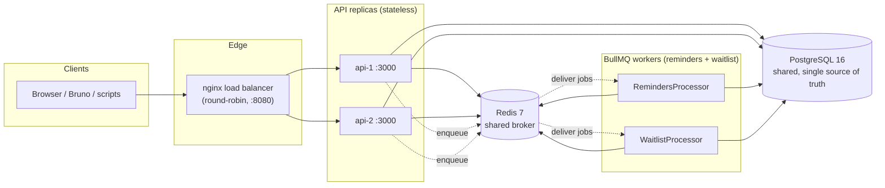
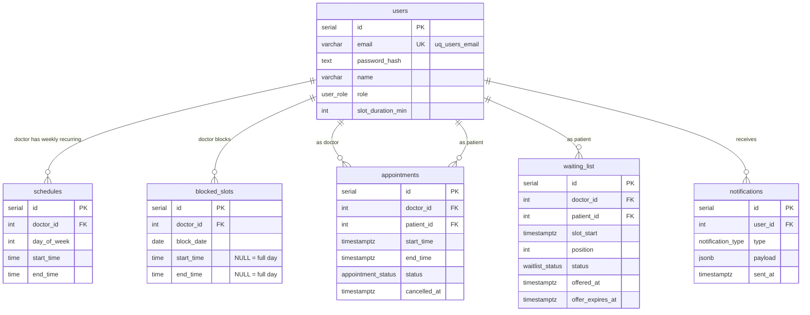
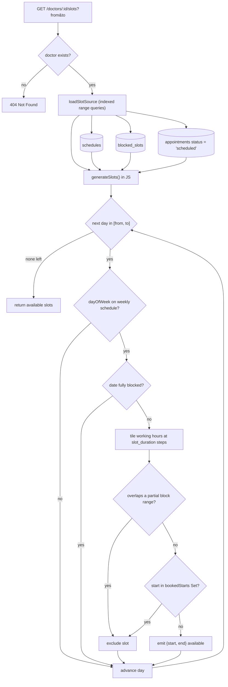
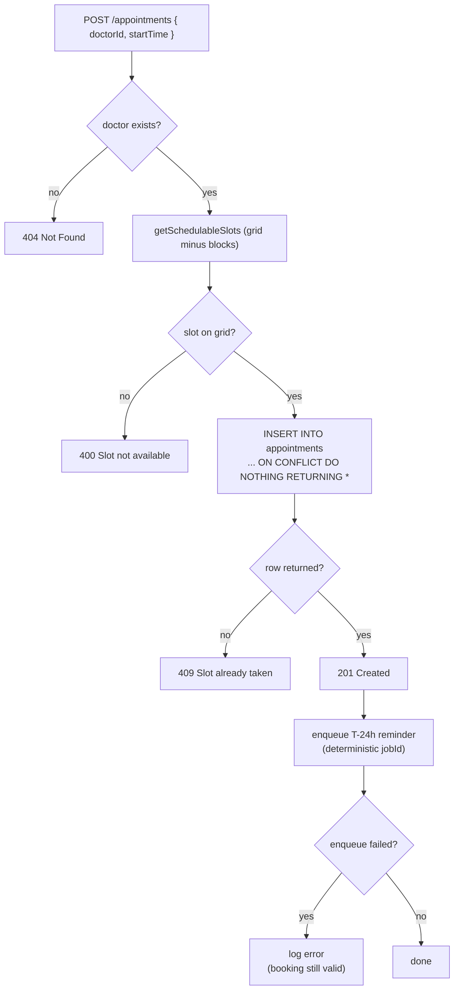
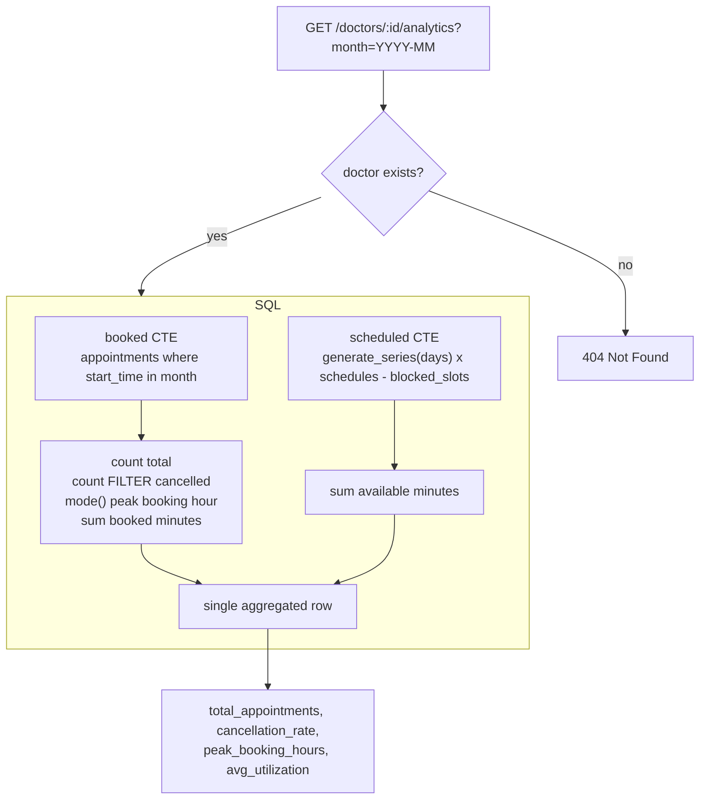
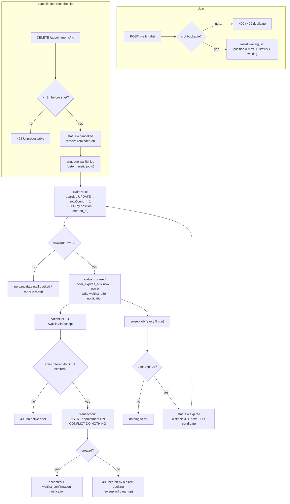
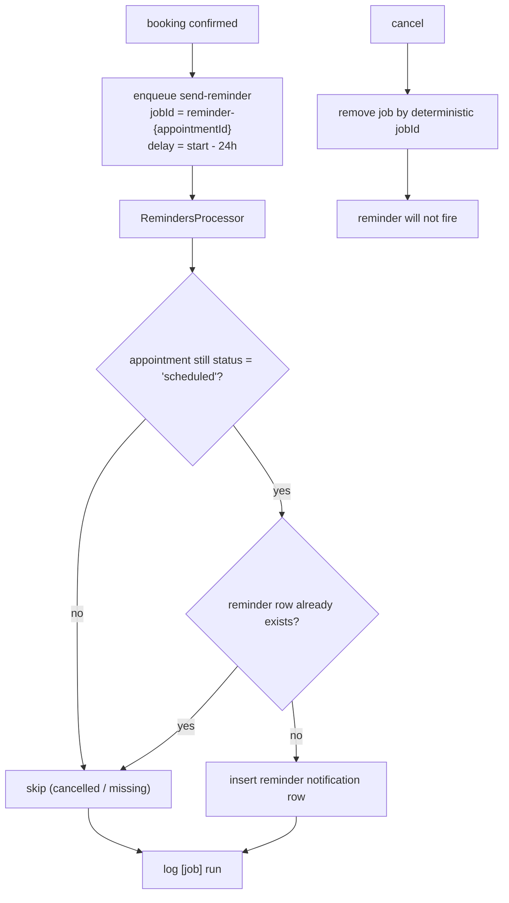

# Architecture & Implementation Diagrams

Mermaid diagrams for the core implementations. These render on GitHub and in most
Mermaid-aware editors. Each diagram reflects the actual code paths.

- [System architecture](#system-architecture)
- [Data model (ER)](#data-model-er)
- [Slot availability](#slot-availability)
- [Booking + concurrency guard](#booking--concurrency-guard)
- [Doctor analytics (pure SQL)](#doctor-analytics-pure-sql)
- [Waiting-list lifecycle](#waiting-list-lifecycle)
- [Reminder background job (idempotency)](#reminder-background-job-idempotency)

---

## System architecture

No in-app locks: the double-booking shield lives in Postgres, so any number of
replicas stays correct. JWT is stateless; job state lives in Redis.

---

## Data model (ER)

Key indexes (full rationale in `README.md`):

- `uq_appt_active_slot` partial unique on `appointments(doctor_id, start_time)
  WHERE status = 'scheduled'` — the concurrency guard.
- `idx_appointments_doctor_start` — availability anti-join + active-slot listing.
- `idx_appointments_patient_start` — "my appointments" + cancel lookups.
- `idx_blocked_slots_doctor_date`, `idx_schedules_doctor`, `idx_waiting_list_slot` —
  fast subtraction/lookup in availability, analytics, and queue claims.

---

## Slot availability

Notes:

- Availability is computed on the fly (no materialized slot table).
- `bookedStarts` uniqueness is guaranteed by `uq_appt_active_slot`, so a simple
  `Set` exclusion is always correct.
- Booking *validation* calls `getSchedulableSlots` (bookings ignored) so a
  legit-but-taken slot flows to the INSERT guard and returns **409**, not 400.

---

## Booking + concurrency guard

The application-level grid check is **only a fast-fail for invalid slots**. Correctness
comes from the partial unique index applied at commit time in Postgres — under any
number of concurrent requests and replicas, exactly one `INSERT` returns a row; all
others conflict and return nothing ⇒ **409**.

---

## Doctor analytics (pure SQL)

- `total_appointments` = appointments whose slot falls in the month.
- `cancellation_rate` = `cancelled / total` (0 when none).
- `peak_booking_hours` = `mode() OVER extract(hour FROM start_time)`.
- `avg_utilization` = `booked_minutes / (scheduled_minutes − blocks)`.

All aggregation happens in Postgres; JavaScript only formats the returned row.

---

## Waiting-list lifecycle

- Offers are **FIFO**, valid **15 minutes**, then swept and the slot recurses.
- `claimNext`'s `UPDATE ... rowCount == 1` makes concurrent/retried jobs unable to
  double-offer the same slot.
- Accept reuses the booking INSERT guard, so a slot can never be assigned twice.

---

## Reminder background job (idempotency)

- The deterministic `jobId` means a re-enqueue or retry can never schedule a
  duplicate.
- On execution the job re-checks the appointment is still `scheduled` and that no
  reminder row exists yet — belt-and-suspenders so retries are side-effect free.
